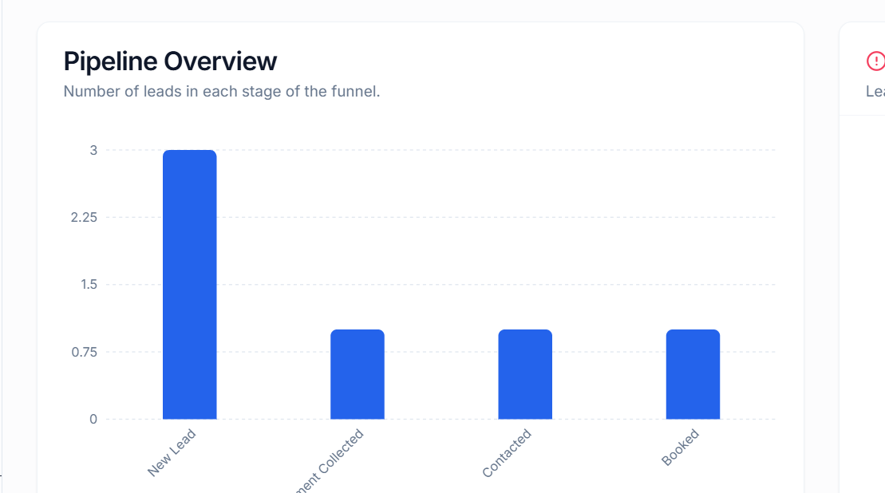

# Gharpayy CRM MVP

A **Lead Management System (CRM)** built for managing property inquiries, tracking lead progress, assigning agents, scheduling property visits, and monitoring lead activity.

## 🚀 Live Demo

https://gharpayy-crm.onrender.com

## Project Preview



## 📌 Features

* Lead creation and management
* Lead pipeline stages (New Lead → Requirement Collected → Contacted → Booked)
* Agent assignment for leads
* Property visit scheduling
* Activity timeline for each lead
* Lead filtering and search
* Dashboard with pipeline overview

## 🛠 Tech Stack

**Frontend**

* React
* Vite
* TypeScript
* TailwindCSS
* Radix UI

**Backend**

* Node.js
* Express.js

**Database**

* PostgreSQL (Neon)

**ORM**

* Drizzle ORM

**Deployment**

* Render (Backend & Frontend)
* Neon (Database)

## 📂 Project Structure

```
client/      → React frontend
server/      → Express backend
shared/      → Shared schemas and types
script/      → Build scripts
```

## ⚙️ Environment Variables

The following environment variable is required:

```
DATABASE_URL=your_postgresql_connection_string
```

## 📦 Installation (Local Development)

Clone the repository:

```
git clone https://github.com/ayushgupta7080/gharpayy-crm.git
```

Install dependencies:

```
npm install
```

Run the development server:

```
npm run dev
```

## 👨‍💻 Author

Ayush Gupta
BSc IT – Software Development
GitHub: https://github.com/ayushgupta7080
